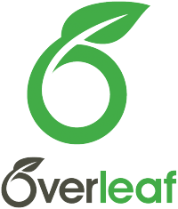

# *LaTeX* Documents

LaTeX is a high-quality typesetting system; it includes features designed for the production of technical and scientific documentation. These are some LaTeX documents I prepared for my school assignments and personal learning. 

Personally, I make use of TeXStudio to prepare my LaTeX documents. It is a requirement to get a compiler to compile LaTeX code. I personally use MikTex for this purpose.

Overleaf is a very good learning platform if you want to get started using LaTeX. It also has its own online compiler. See below links to the various tools required to get you started.

TeXStudio &rarr; *[TeXStudio](https://www.texstudio.org/)*

MikTex &rarr; <a href="https://miktex.org/" target="_blank"><i>MikTeX</i></a>

# Compiling LaTeX in VS code

VS code is mostly used amongst developers. 

- Download and install *MikTeX*
- Install the LaTeX Workshop extension on the VS code marketplace by James Yu.
- Download and install *Strawberry Perl* form their official website.   Strawberry Perl &rarr;  *[Perl](https://strawberryperl.com/)*
- LaTeX document is now ready to be compiled in VS code

# Get started learning LaTeX 

Overleaf is a collaborative cloud-based LaTeX editor used for writing, editing and publishing scientific documents.   Overleaf offers comprehensive and free tutorials on their official website. It has an omline compiler for convenience. Check it out!  
Overleaf &rarr;  *[Overleaf](https://www.overleaf.com/)*

